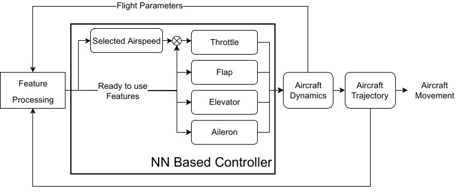
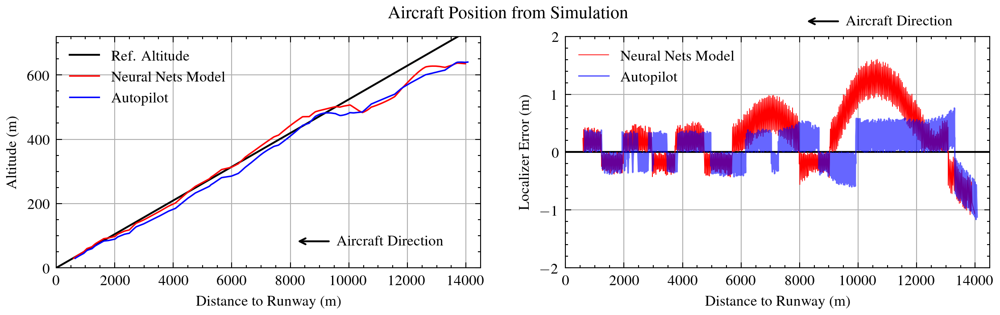
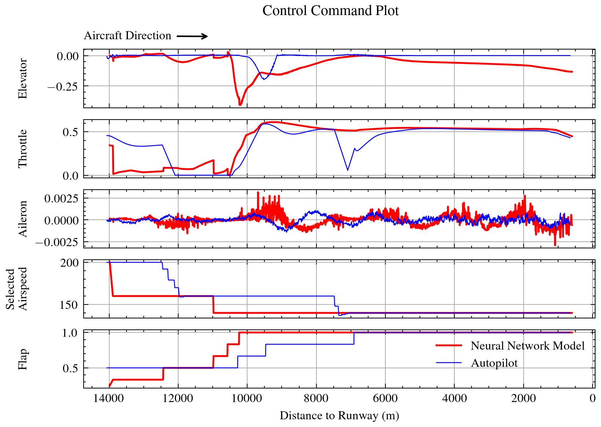

<h1 align="center">
    Deeplanding
</h1>

<p align="center">
  <a href="#Summary">Summary</a> •
  <a href="#Installation">Installation</a> •
  <a href="#Datasets">Datasets</a> •
  <a href="#Training">Training</a> •
  <a href="#Testing using X-Plane">Testing</a> •
  <a href="#Results">Results</a>
</p>


<h4 align="center">Deep learning based autolanding system</h4>

## Summary
Deeplanding is an automatic landing system made using deep learning approach. Deeplanding system consists of 5 neural network models that work in parallel to controll the aircraft movement to keep the aircraft on the glide slope while also centered with the runway.


<h5 align="center">Diagram of how Deeplanding works.</h5>

You can see full simulation test of deeplanding in this [YouTube video](https://youtu.be/NRJc_1XePok)


## Installation
To run this codes there are few dependencies and set up that you have to do. You also need to install [X-Plane Connect](https://github.com/nasa/XPlaneConnect) plugin on your X-Plane installation to be able to record or test this model.


### 1. Environtment and Dependencies
First you are advised to create a new environtment on conda to install our dependencies.
```bash
# Create new conda environtment
# and also install few dependencies
$ conda create -n deeplanding tensorflow pandas matplotlib 

# Make sure to activate the newly created environtment
$ conda activate deeplanding

# Install keras-tuner
$ conda install -c conda-forge keras-tuner
```

Additionally, if you want graph visualization when testing the models on X-Plane, you should also install `streamlit`
```bash
$ conda install -c conda-forge streamlit 
```

To be able to run jupyter notebook files (.ipynb) you also need to install `jupyter`.
```bash
$ conda install -c anaconda jupyter 
```

### 2. Seting up directory structure
1. First, clone this repository
```bash
$ git clone https://github.com/perfect-less/deeplanding
```
2. Now go inside newly created `deeplanding` folder and clone `TA-HPC-Scripts` repository.
```bash
# Go into deeplanding folder
$ cd deeplanding

# Clone TA-HPC-Scripts repo
$ https://github.com/perfect-less/TA-HPC-Scripts
```
3. Go to [XPlaneConnect](https://github.com/nasa/XPlaneConnect) repo, download `xpc` folder and its content in `XPlaneConnect/Python3/src`. 
4. Put `xpc` folder and its content in `deeplanding/xpcclient/xpc`. Your directory structure should looks approximately like this:
```bash
$ deeplanding
$ ├── ...
$ └── TA-HPC-Scripts
$     └── ...
$ └── xpcclient
$     └── xpc
$         └── ...
```


## Datasets
You can read [here](how-to-record-flight-data.md) on how to record your own flight data. Alternatively, you can also use my 80 flight recordings that can be accessed through this [link](https://drive.google.com/file/d/1XndXPOW-HnZZo4P5uyb_17sEKGBRwjzn/view?usp=share_link).

There's an additional step you must do before the recorded data can be used to train our models. The data must first be trimmed and separated between data for training longitudinal models (elevator, throttle, selected airspeed, and flap) and aileron model.

Follow the following procedure to trimmed the data before training:

1. Put all flight data into ```xpcclient/Records/``` directory
2. Change directory to `xpcclient` and run `cutRecordings.py`.
```bash
$ cd xpcclient
# cut data to use for training the longitudinal models
$ python cutRecordings.py --out_dir Trimmed.lon
# cut another data to use for training aileron model
$ python cutRecordings.py -a --out_dir Trimmed.ail
```
3. Now, data for aileron model can be found inside `Trimmed.ail` folder, while data for longitudinal models can be found inside `Trimmed.lon` folder.


## Training
Step-by-step procedure on how to use the data that we have prepared on the previous section can be found on [TA-HPC-Scripts](https://github.com/perfect-less/TA-HPC-Scripts) repo.

Please make sure you are inside `TA-HPC-Scripts` folder before you train your models.

## Testing using X-Plane
1. Place the trained models into `xpcclient/Models/`. You can train your own models or use my already trained models [here](https://drive.google.com/file/d/1p0XxyP4oqsGiQO9bRAGdYt7kgwQ6WNg9/view?usp=share_link). The directory structure should look like bellow. Also make sure that the name of your models' folder are the same as it appear bellow.
```bash
$ deeplanding
$ ├── ...
$ └── xpcclient
$     └── Models
$         └── Elevator
$         └── Throttle
$         └── Aileron
$         └── Flap
$         └── SelectetAirspeed
$ ├── ...
$ ...
```
2. Open X-Plane, select B747, and set it for approach on runway 36R Memphis Intl. Airport, turn on autopilot so the plane follow the localizer on a steady level flight, then pause the X-Plane simmulation. Make sure the plane still far away from intercepting the glide slope.
3. Change directory to `xpcclient` and run `runDeeplandController.py`.
```bash
$ cd xpcclient/
$ python runDeeplandController.py
```
4. When the script is finally running, unpaused X-Plane. Continue the flight and just before glide slope about to be intercepted, turn of the autopilot.
5. The script should take controll of the aircraft as soon as the glide slope was intercepted.

If you want to have visualization of the aircraft's position and the controll command of the deep learning model, on step no. 3, run `runDeeplandContWithSt.py` instead of `runDeeplandController.py`.

## Results
Bellow are the plot of aircraft's trajectory both controlled by Deeplanding and autopilot from X-Plane.

<h5 align="center">Aircraft's Trajectory.</h5>

As can be clearly seen above, on vertical plane there's isn't much different between the two. But relative to the localizer, the error from Deeplanding were noticeably larger than from the autopilot.

We can also see the controll command send by both Deeplanding and autopilot.

<h5 align="center">Controll Command Plot.</h5>

So, in this experiment Deeplanding were able to steer the aircraft to land right into the runway, although the localizer error are still noticably larger than from X-Plane's autopilot. Hopefully with knowledge and experience gained from this experiment, and also with larger datasets, a more robust and reliable deep learning based autoland system can be develop.

NOTES: You should also check all jupyter notebook files in this repository including the one inside `TA-HPC-Scipts` folder to learn more about data and models in this experiments. To be able to run the notebook make sure to install jupyter.
```bash
$ conda install -c anaconda jupyter
```
